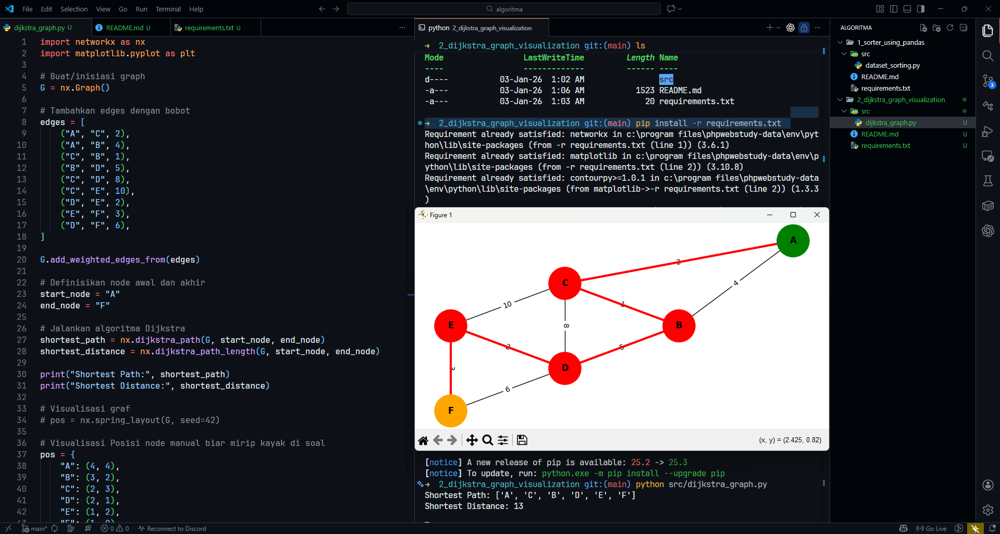

# Dijkstra Graph Visualization Program

This is a simple Python program that demonstrates the use of
**Dijkstra's Algorithm** to find the shortest path in a weighted graph.
The program is designed for academic purposes and demonstrates basic
graph processing, shortest path calculation, and visualization using
Python.

## Features

-   Display a weighted undirected graph
-   Calculate the shortest path using Dijkstra's algorithm
-   Visualize nodes and weighted edges
-   Highlight the shortest path in a different color

## Graph Structure

The graph consists of the following nodes: - **A** (Node A) - **B**
(Node B) - **C** (Node C) - **D** (Node D) - **E** (Node E) - **F**
(Node F)

Each edge between nodes has a weight representing distance or cost.

## Project Structure

    2_dijkstra_graph_visualization/
    │
    ├── src/
    │   └── dijkstra_graph.py
    │
    ├── requirements.txt
    │
    └── README.md

## Requirements

-   Python 3.x
-   networkx
-   matplotlib

Install dependencies using:

``` bash
pip install -r requirements.txt
```

## How to Run

From the project root directory, run:

``` bash
python src/dijkstra_graph.py
```

## Example Output




## Notes

-   This program uses NetworkX to implement Dijkstra's algorithm.
-   Matplotlib is used for graph visualization.
-   The program is suitable for beginners learning graph algorithms and
    shortest path problems.

## Author

Rizal Suryawan - Software Engineer
